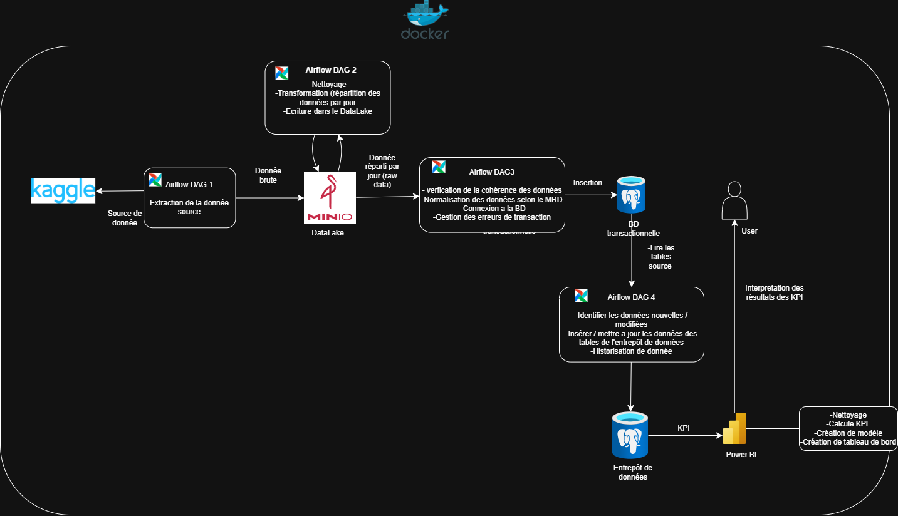

## Description du projet

* Ce projet met en place une pipeline de traitement de données complète permettant :

* L’extraction de données depuis diverses sources brutes, comme des fichiers CSV.

* Le stockage de ces données dans un Data Lake pour conservation et analyse.

* La transformation et le chargement des données dans une base de données opérationnelle.

* L’historisation des données dans un entrepôt de données pour faciliter l’analyse et la visualisation.

L’objectif est de construire une architecture modulaire, automatisée et scalable, capable de centraliser et de traiter efficacement les données pour répondre aux besoins analytiques et opérationnels

## Architecture générale

## Exécution du pipeline

### Cloner le dépôt
`git clone https://github.com/nadia-5/projet-MIG8110`

`cd projet-MIG8110`
`cd terraform`
`terraform init
`terraform plan
`terraform apply
`cd..` 
### chargement des donnée dans minio et BD operationnelle
`python local_run.iypnb`
`psql -h postgres -U admin -d operations`

